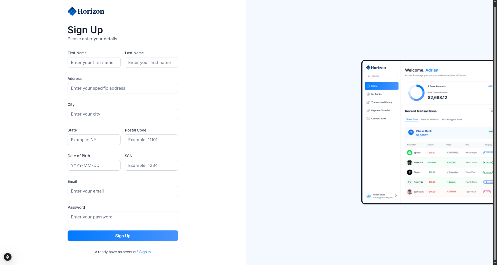
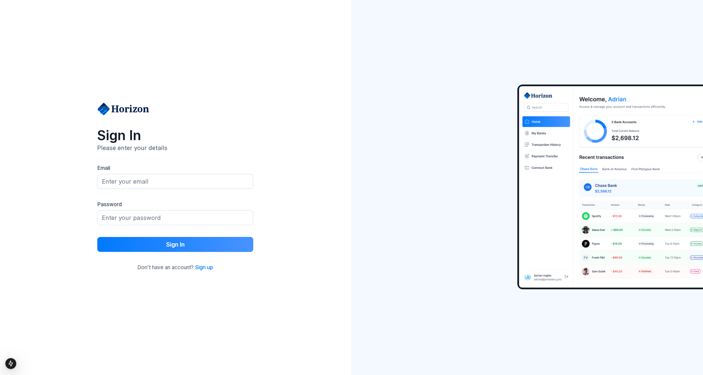
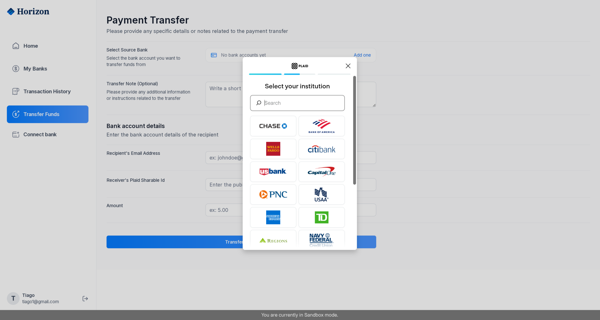
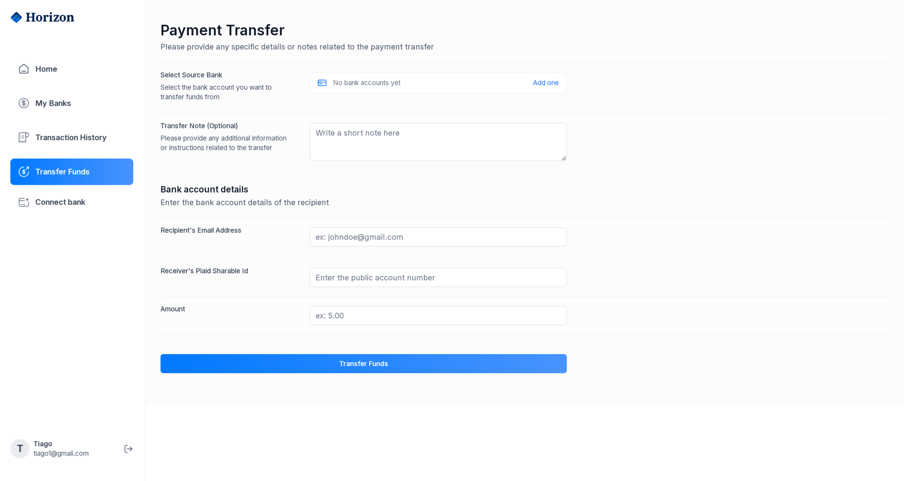

# Horizon Banking Platform

Horizon is a demo digital-banking experience built with Next.js, Appwrite, Plaid, and Dwolla. It guides a customer from onboarding and bank linking through peer-to-peer transfers and transaction tracking.

> **⚠️ Status:** The project currently has known bugs/regressions. A maintenance pass is planned soon to address them; expect intermittent issues until then.

## Product Glimpse

| Screen | Preview |
| --- | --- |
| **Sign up** – captures identity fields required to provision Dwolla + Appwrite accounts. |  |
| **Sign in** – lightweight email/password form backed by Appwrite sessions. |  |
| **Connect bank** – launches Plaid Link to link an institution and store its processor token. |  |
| **Transfer funds** – lets the user pick source/destination banks, add metadata, and trigger Dwolla transfers. |  |

## Features

- Email/password authentication with Appwrite sessions and secure cookies.
- Bank linking flow: Plaid Link → token exchange → Dwolla customer funding source creation.
- Account aggregation showing balances, institutions, and masked numbers.
- Transaction timeline that merges Plaid data with Dwolla transfer history.
- Peer-to-peer transfer form with validation, masked IDs, and Dwolla payouts.
- Responsive UI built with Tailwind CSS and shadcn/ui components.

## Tech Stack

- **Framework:** Next.js 15 (App Router, Server Actions, RSC)
- **Language:** TypeScript
- **Styling/UI:** Tailwind CSS, shadcn/ui, Lucide icons
- **Auth & Database:** Appwrite (Accounts, Databases, Users)
- **Banking APIs:** Plaid (Link, Accounts, Transactions, Processor tokens)
- **Payments:** Dwolla (customer + funding sources + transfers)
- **Utilities:** react-hook-form, zod, react-plaid-link, node-appwrite

## Project Structure (selected)

```
app/
  (root)/               # Public routes (home, transaction history, etc.)
components/             # Reusable UI + forms (BankDropdown, PlaidLink, etc.)
lib/
  actions/              # Server actions (auth, bank, transaction, dwolla)
  appwrite.ts           # Admin/session Appwrite clients
  plaid.ts              # Plaid client bootstrap
  utils.ts              # Helpers (formatting, encryption, URL helpers)
types/                  # Shared TypeScript declarations
docs/images/            # Marketing screenshots used in README
```

## Environment Configuration

Copy `.env copy` to `.env` and fill in the values for your Appwrite, Plaid, and Dwolla projects.

| Variable | Description |
| --- | --- |
| `NEXT_PUBLIC_APPWRITE_ENDPOINT` | Appwrite REST endpoint |
| `NEXT_PUBLIC_APPWRITE_PROJECT` | Appwrite project ID |
| `APPWRITE_DATABASE_ID` | Database that stores user/bank/transaction docs |
| `APPWRITE_USER_COLLECTION_ID` | Collection for extended user profile |
| `APPWRITE_BANK_COLLECTION_ID` | Collection for linked banks |
| `APPWRITE_TRANSACTION_COLLECTION_ID` | Collection for transfer history |
| `NEXT_APPWRITE_KEY` | API key with Account + Database scopes |
| `PLAID_CLIENT_ID`, `PLAID_SECRET`, `PLAID_ENV` | Plaid credentials |
| `DWOLLA_KEY`, `DWOLLA_SECRET`, `DWOLLA_BASE_URL` | Dwolla sandbox credentials |

> ⚠️ Never commit real credentials. Treat these secrets like production keys.

## Getting Started

```bash
git clone <repo>
cd banking-app-platform
npm install
cp ".env copy" .env   # then edit with your values
npm run dev
```

Visit `http://localhost:3000` and create an account via the sign-up flow.

## Core Flow Overview

1. **Authentication**
   - `signUp` action creates an Appwrite user, Dwolla customer, Appwrite document, and logs the session cookie.
   - `signIn` simply creates an Appwrite email/password session and stores it in `appwrite-session`.

2. **Linking a Bank**
   - `PlaidLink` obtains a link token via `createLinkToken`.
   - After the Link flow, `exchangePublicToken` swaps the public token for an access token, stores the bank metadata in Appwrite, and revalidates the dashboard.

3. **Rendering the Dashboard**
   - `getAccounts` fetches the user’s saved banks, calls Plaid’s Accounts API per bank, and aggregates balances.
   - `getAccount` merges Plaid transactions and Dwolla transfer records for the detailed view.

4. **Transfers**
   - `PaymentTransferForm` validates input with zod/react-hook-form, fetches sender/receiver Appwrite docs, calls Dwolla’s transfer API, then records the movement in Appwrite.

## Available Scripts

| Command | Description |
| --- | --- |
| `npm run dev` | Start Next.js in development mode |
| `npm run build` | Create a production build |
| `npm run start` | Launch the production server |

## Testing Suggestions

- Use Plaid’s sandbox credentials (e.g., `user_good`, `pass_good`) when Link asks for banking login details.
- Review Appwrite dashboards (Users, Databases) to ensure documents are written correctly after each action.
- Check Dwolla sandbox for generated customers and funding sources.

## Roadmap Ideas

- Add unit tests around server actions with Vitest.
- Support multiple currencies and exchange rates.
- Add pagination + filtering at the Appwrite query level instead of in-memory.

---

Feel free to open issues or PRs if you extend Horizon. Happy hacking!
This is a [Next.js](https://nextjs.org) project bootstrapped with [`create-next-app`](https://nextjs.org/docs/app/api-reference/cli/create-next-app).

## Getting Started

First, run the development server:

```bash
npm run dev
# or
yarn dev
# or
pnpm dev
# or
bun dev
```

Open [http://localhost:3000](http://localhost:3000) with your browser to see the result.

You can start editing the page by modifying `app/page.tsx`. The page auto-updates as you edit the file.

This project uses [`next/font`](https://nextjs.org/docs/app/building-your-application/optimizing/fonts) to automatically optimize and load [Geist](https://vercel.com/font), a new font family for Vercel.

## Learn More

To learn more about Next.js, take a look at the following resources:

- [Next.js Documentation](https://nextjs.org/docs) - learn about Next.js features and API.
- [Learn Next.js](https://nextjs.org/learn) - an interactive Next.js tutorial.

You can check out [the Next.js GitHub repository](https://github.com/vercel/next.js) - your feedback and contributions are welcome!

## Deploy on Vercel

The easiest way to deploy your Next.js app is to use the [Vercel Platform](https://vercel.com/new?utm_medium=default-template&filter=next.js&utm_source=create-next-app&utm_campaign=create-next-app-readme) from the creators of Next.js.

Check out our [Next.js deployment documentation](https://nextjs.org/docs/app/building-your-application/deploying) for more details.
